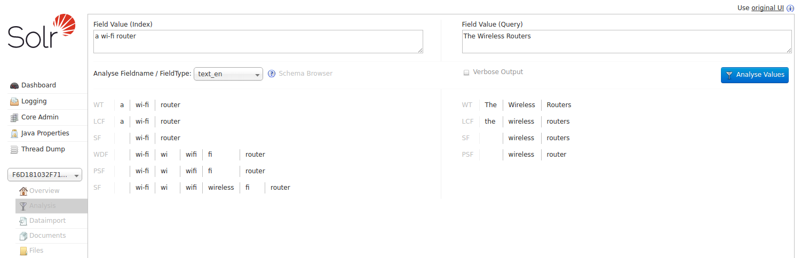

# Primjer analize

Bilješke:
---
<table class="stretch">
    <tr>
        <th style="border-right: 1px solid rgb(34, 34, 34);"></th>
        <th colspan="7" style="border-right: 1px solid rgb(34, 34, 34);">Dokument</th>
        <th colspan="2">Upit</th>
    </tr>
    <tr>
        <td style="border-right: 1px solid rgb(34, 34, 34);"></td>
        <td colspan="7" style="border-right: 1px solid rgb(34, 34, 34);">A Wi-Fi Router
        </td>
        <td colspan="2">wireless routers</td>
    </tr>
    <tr>
        <td style="border-right: 1px solid rgb(34, 34, 34);">Tokenizacija</td>
        <td>A</td>
        <td>Wi-Fi</td>
        <td colspan="5" style="border-right: 1px solid rgb(34, 34, 34);">Router
        </td>
        <td>wireless</td>
        <td>routers</td>
    </tr>
    <tr>
        <td style="border-right: 1px solid rgb(34, 34, 34);">Pretvaranje u mala slova</td>
        <td>a</td>
        <td>wi-fi</td>
        <td colspan="5" style="border-right: 1px solid rgb(34, 34, 34);">router
        </td>
        <td>wireless</td>
        <td>routers</td>
    </tr>
    <tr>
        <td style="border-right: 1px solid rgb(34, 34, 34);">Zaustavne riječi</td>
        <td></td>
        <td>wi-fi</td>
        <td colspan="5" style="border-right: 1px solid rgb(34, 34, 34);">router
        </td>
        <td>wireless</td>
        <td>routers</td>
    </tr>
    <tr>
        <td style="border-right: 1px solid rgb(34, 34, 34);">Razdjelnici riječi (samo za indeks)</td>
        <td></td>
        <td>wi-fi</td>
        <td>wi</td>
        <td>fi</td>
        <td>wifi</td>
        <td colspan="2" style="border-right: 1px solid rgb(34, 34, 34);">router
        </td>
        <td>wireless</td>
        <td>routers</td>
    </tr>
    <tr>
        <td style="border-right: 1px solid rgb(34, 34, 34);">Stemming</td>
        <td></td>
        <td>wi-fi</td>
        <td>wi</td>
        <td>fi</td>
        <td>wifi</td>
        <td colspan="2" style="border-right: 1px solid rgb(34, 34, 34);">router
        </td>
        <td>wireless</td>
        <td>router</td>
    </tr>
    <tr>
        <td style="border-right: 1px solid rgb(34, 34, 34);">Sinonimi wifi &rarr; wireless (samo za indeks)</td>
        <td></td>
        <td>wi-fi</td>
        <td>wi</td>
        <td>fi</td>
        <td>wifi</td>
        <td>
            wireless
        </td>
        <td style="border-right: 1px solid rgb(34, 34, 34);">
            router
        </td>
        <td>
            wireless
        </td>
        <td>
            router
        </td>
    </tr>
</table>

Bilješke:
Povećava relevantnost, ali smanjuje preciznost
---

Bilješke:
---

<!-- .slide: class="audience-question" -->

# Ishod

* &shy;<!-- .element: class="fragment" --> Pronađite više rezultata: _wireless_ &rarr; _wi-fi_
* &shy;<!-- .element: class="fragment" --> Pronađite više nepreciznih rezultata: _wi-fi_ &rarr; _wireless_
* &shy;<!-- .element: class="fragment" --> Propustite neke rezultate: _to be or not to be_

Bilješke:

* Hoće li ovo pronaći više rezultata?
* Hoće li ovo pronaći manje točne rezultate?
