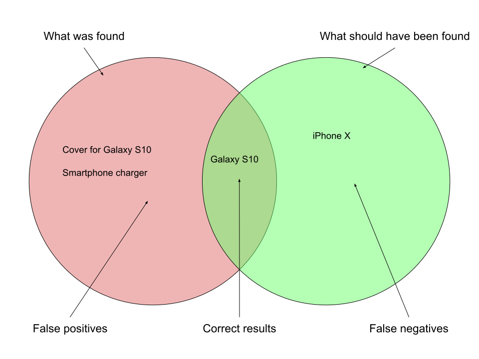

# Preciznost i odziv (eng. Precision & Recall)

Bilješke:
---

# Preciznost 

Jesu li svi rezultati relevantni?

$$\text{Preciznost} = \frac{\text{broj relevantnih rezultata}}{\text{ukupan broj rezultata}}$$

Bilješke:
---

# Odziv 

Jesu li svi relevantni dokumenti u rezultatima?

$$\text{Odziv} = \frac{\text{broj pronađenih relevantnih dokumenata}}{\text{ukupan broj relevantnih dokumenata}}$$

Notes:
---

<!-- .slide: class="audience-question" -->

Bilješke:
Kako evaluirati?
---

# Evaluacija

* Zahtijeva ljudski trud
* Ručno anotirani korpus:

----

| Potreba za informacijom | iPhone X | Galaxy S10 | Cover for Galaxy S10 | Battery Pack |
|--------------------------|----------|------------|----------------------|--------------|
| smartphone               | ✓        | ✓          | -                    | -            |
| apple smartphone         | ✓        | -          | -                    | -            |
| smartphone accessory     | -        | -          | ✓                    | ✓            |

Nadopuniti logovima (zapisima) klikanja

Bilješke:
---

<!-- .slide: class="audience-question" -->

&shy;<!-- .element: class="stretch" -->

Preciznost za _smartphone_? 33%<!-- .element: class="fragment" -->

Odziv za _smartphone_? 50%<!-- .element: class="fragment" -->

Bilješke:

* Pitanje publici

---

# Preciznosti i odziv

<!-- .slide: class="audience-question" -->

* &shy;<!-- .element: class="fragment" --> Nikada neće biti 100% oba, pa:
* &shy;<!-- .element: class="fragment" --> Rangiraj rezultate prema relevantnosti

Bilješke:

* Kako postići 100% odziv?
* Koji bi mogli biti kriteriji za rangiranje rezultata?
