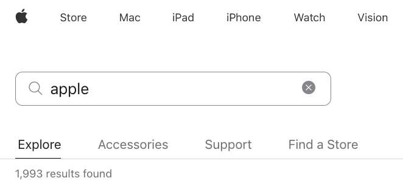

# Rangirano pretraživanje

Bilješke:

---

# Ideja I

Više podudaranja pojmova iz upita = relevantniji dokument


Wikipedia članak o `book` vs. `paper`

Bilješke:

---

# Ideja II

Rijetki pojmovi u zbirci su relevantniji




Pretraživanje apple.com za `apple macbook`: `macbook` je relevantniji od `apple`

Bilješke:

---

# I: Frekvencija pojma

<!-- .slide: class="audience-question" -->

### <!-- .element: class="fragment" --> Tijekom indeksiranja:

* &shy;<!-- .element: class="fragment" --> Broji se učestalost pojmova po dokumentu
* &shy;<!-- .element: class="fragment" --> Redoslijed pojmova se ignorira
* &shy;<!-- .element: class="fragment" --> _Vreća riječi (Bag of words)_

&shy;<!-- .element: class="fragment" --> 

Bilješke:

* Gdje spremiti podatke o TF?

---

# TF

<!-- .slide: class="audience-question" -->

* \#1: _a book providing information about information retrieval_
* \#2: _a book about the search for books_
* \#3: _a book about information_

***

| Pojam       | ID-ovi dokumenata                                 |
|-------------|--------------------------------------------------|
| Book        | #1:1, #2:2, #3:1 <!-- .element: class="fragment" --> |
| Information | #1:2, #3:1 <!-- .element: class="fragment" -->       |
| Retrieval   | #1:1         <!-- .element: class="fragment" -->     |
| Search      | #2:1         <!-- .element: class="fragment" -->     |

Bilješke:

* Sudjelovanje publike

---

# II: Inverzna frekvencija dokumenta

<!-- .slide: class="audience-question" --> 

* &shy;<!-- .element: class="fragment" --> Pretraživanje apple.com za `apple OR macbook`
    * manje dokumenata s `macbook` nego s `apple`
    * `macbook` je važniji
* &shy;<!-- .element: class="fragment" --> Rijetki pojmovi se rangiraju više
* &shy;<!-- .element: class="fragment" --> Relevantno samo za OR pretraživanje
* &shy;<!-- .element: class="fragment" --> Sprema se inverzna frekvencija dokumenta po pojmu

Bilješke:

* Zašto je ovo relevantno samo za OR pretraživanje?
* Zašto se sprema po pojmu?
* Što su minimalni i maksimalni IDF? Zašto?

---

# Inverzna frekvencija dokumenta

$$\begin{aligned}
\text{idf}(\text{pojam}) & = \frac{\text{broj_dokumenata}}{\text{frekvencija_dokumenta}(\text{pojam})}\\\\
\\\\
\text{idf}(\text{apple}) & = \frac{10}{9} = 1.1 \\\\
\\\\
\text{idf}(\text{macbook}) & = \frac{10}{2} = 5
\end{aligned}$$
---

# IDF

<!-- .slide: class="audience-question" -->

* \#1: _a book providing information about information retrieval_
* \#2: _a book about the search for books_
* \#3: _a book about information_

***

| Pojam       | IDF                                    | ID-ovi dokumenata |
|-------------|----------------------------------------|-------------------|
| Book        | 1  <!-- .element: class="fragment" --> | #1:1, #2:2, #3:1  |
| Information | 1.5<!-- .element: class="fragment" --> | #1:2, #3:1        |
| Retrieval   | 3  <!-- .element: class="fragment" --> | #1:1              |
| Search      | 3  <!-- .element: class="fragment" --> | #2:1              |

Bilješke:

* idf(t) = 1 je poseban slučaj
* Sudjelovanje publike

---

# Rangiranje prema TF-IDF

$$\text{score}(\text{upit}, \text{dokument}) = \sum_{\text{pojam} \in \text{upit}} \left( \text{tf}(\text{pojam},
\text{dokument}) \times \text{idf}(\text{pojam}) \right)$$

Bilješke:

* Objasnite formulu jednostavnim jezikom.

---

<!-- .slide: class="audience-question" --> 

| Pojam       | IDF | ID-ovi dokumenata |
|-------------|-----|-------------------|
| Book        | 1   | #1:1, #2:2, #3:1  |
| Information | 1.5 | #1:2, #3:1        |
| Retrieval   | 3   | #1:1              |
| Search      | 3   | #2:1              |


```
information retrieval search
```

### \#1

2 &times; 1.5 + 1 &times; 3 + 0 &times; 3 = 6 <!-- .element: class="fragment" -->

### \#2

0 &times; 1.5 + 0 &times; 3 + 1 &times; 3 = 3 <!-- .element: class="fragment" -->

### \#3

1 &times; 1.5 + 0 &times; 3 + 0 &times; 3 = 1.5 <!-- .element: class="fragment" -->

Bilješke
