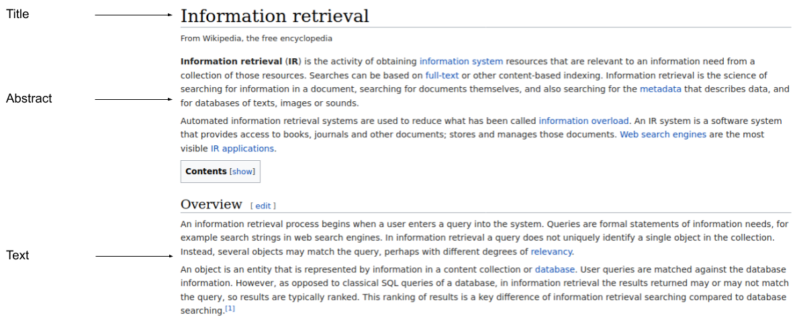

# Iskoristite strukturu dokumenta za rangiranje

<!-- .slide: class="audience-question" -->

Bilješke:

Kako možemo iskoristiti strukturu dokumenta za poboljšanje rangiranja? Razmislite o tipičnom članku na Wikipediji.

---

# Struktura dokumenta

<!-- .slide: class="audience-question" -->

Bilješke:
Kako možemo iskoristiti ovu informaciju za potrebe rangiranja?
---

# Težine polja

<!-- .slide: class="audience-question" -->

Bilješke:

Kako možemo odrediti težine polja?

---

<!-- .slide: class="audience-question" -->

# Indeksiranje prema poljima

| Dokument | Autor           | Naslov                                                   |
|----------|-----------------|----------------------------------------------------------|
| #1       | Arthur McAuthor | A book providing information about information retrieval |
| #2       | Shakesbeer      | A book about the search for King Arthur                  |

***

| Pojam       | ID-ovi dokumenata                                      |
|-------------|--------------------------------------------------------|
| arthur      | #1:Author, #2:Title<!-- .element: class="fragment" --> |
| book        | #1:Title, #2:Title<!-- .element: class="fragment" -->  |
| information | #1:Title<!-- .element: class="fragment" -->            |
| mcauthor    | #1:Author<!-- .element: class="fragment" -->           |
| shakesbeer  | #2:Author<!-- .element: class="fragment" -->           |
| ...         |

Bilješke:

---

# Težine polja

<!-- .slide: class="audience-question" -->

| Pojam                                                                                                                                                             | ID-ovi dokumenata                                                                                                                                                       |
|------------------------------------------------------------------------------------------------------------------------------------------------------------------|-----------------------------------------------------------------------------------------------------------------------------------------------------------------------|
| arthur | #1:Author, #2:Title |
| book   | #1:Title, #2:Title  |
| ...                                                                                                                                                              |

***

$$\begin{aligned}
\text{weight}(\text{author}) & = 10\\\\
\text{weight}(\text{title}) & = 1
\end{aligned}$$

***

&shy;<!-- .element: class="fragment" data-fragment-index="1" --> `arthur book`?

* \#1
  &rarr; <!-- .element: class="fragment" data-fragment-index="2" --> 
  author + title = 10 + 1 = **11**
* \#2
  &rarr; <!-- .element: class="fragment" data-fragment-index="4" --> 
  title + title = 1 + 1 = **2**

Bilješke:

---

# Težine polja

* Teško je odrediti težine
* Koristite označeni korpus i strojno učenje

Bilješke:

Što se još može napraviti s informacijama iz polja? -> Upiti prema poljima!
---

# Upiti prema poljima

<!-- .slide: class="audience-question" -->

| Pojam       | ID-ovi dokumenata    |
|-------------|----------------------|
| arthur      | #1:Author, #2:Title |
| shakesbeer  | #2:Author           |
| ...         |

***

* &shy;<!-- .element: class="fragment" --> `title:arthur`?
    * &shy;<!-- .element: class="fragment" --> #2
* &shy;<!-- .element: class="fragment" --> `author:shakesbeer`?
    * &shy;<!-- .element: class="fragment" --> #2

Bilješke:

Pitanje
