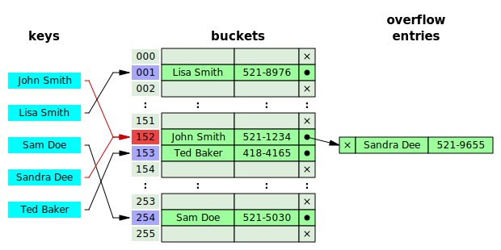

# Struktura vokabulara

Bilješke:
---

# Struktura vokabulara

* &shy;<!-- .element: class="fragment" --> Rječnik / Hash tablica
* &shy;<!-- .element: class="fragment" --> Stablo pretraživanja

Bilješke:

* Prijedlozi?

---

# Hash tablica

&shy;<!-- .element: class="stretch" -->

&shy;<!-- .element: style="font-size: small;" --> Autor: Jorge Stolfi - Vlastiti rad, CC BY-SA
3.0, https://commons.wikimedia.org/w/index.php?curid=6471238

Bilješke:

* Koja je složenost dohvaćanja / umetanja? Postaje li sporije s više unosa?

---

# Hash tablica

* \+ Brzo dohvaćanje: &Omicron;(1): Izračunaj hash, slijedi pokazivač
* \+ Brzo umetanje: &Omicron;(1)
* \- Kolizije hashova: Najgora složenost: &Omicron;(n)

<!-- .element: style="list-style-type: none;" -->

Bilješke:
---

# Kolizije u hash tablici

&shy;<!-- .element: class="stretch" -->

&shy;<!-- .element: style="font-size: small;" --> Autor: Jorge Stolfi - Vlastiti rad, CC BY-SA
3.0, https://commons.wikimedia.org/w/index.php?curid=6472274

Dodatno dohvaćanje je potrebno kada se hashevi sudaraju. U najgorem slučaju: &Omicron;(n)

Bilješke:
---

<h1>Stablo pretraživanja</h1>

Najviše dvoje djece po čvoru (binarno stablo)

Bilješke:
Koja je složenost dohvaćanja / umetanja? Postaje li sporije s više unosa? Koliko? Ο(log n)
---

# Stablo pretraživanja

* \+ Brzo dohvaćanje: &Omicron;(log n): Prosječna visina stabla
* \+ Brzo umetanje: &Omicron;(log n)
* \+ Podržava pretraživanje prefiksa

<!-- .element: style="list-style-type: none;" -->

***

* Različite vrste stabala koriste se ovisno o slučaju
* Npr., Binarno stablo (u memoriji), B-stablo (na disku)

Bilješke:
