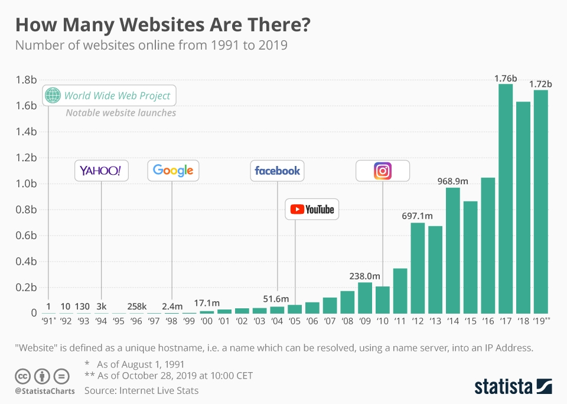
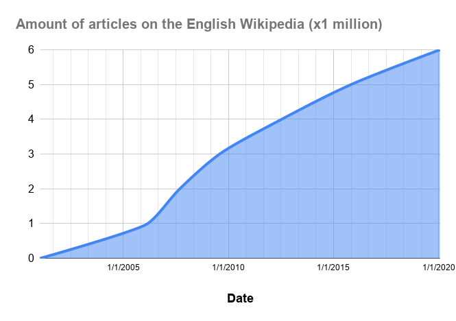
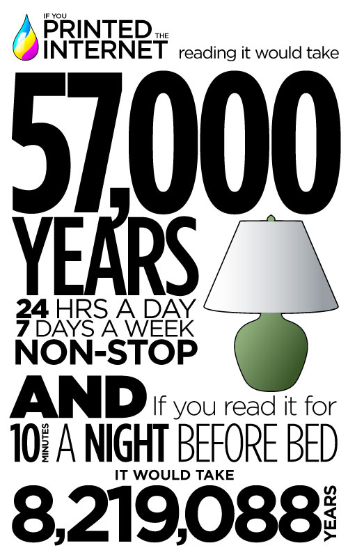

# Motivacija
---

# Informacijsko pretraživanje i pronalaženje (eng. Information Retrieval)

> Informacijsko pretraživanje i pronalaženje (IR) odnosi se na aktivnost dohvaćanja resursa informacijskih sustava koji su relevantni za određenu informacijsku potrebu
> iz određene zbirke.

> Web tražilice su najprepoznatije IR aplikacije.

Napomene:  
Koja je motivacija za informacijsko pretraživanje? Koji su neki primjeri primjene?
---
&shy;<!-- .element: class="stretch" -->
---
&shy;<!-- .element: class="stretch" -->
---
&shy;<!-- .element: class="stretch" -->
---

# IR je svugdje prisutan

* Internet
* eTrgovina
* Sustavi za upravljanje sadržajem (CMS), blogovi
* Intranet
* Akademska zajednica
* ...

---

# Izazovi

* Visoka kvaliteta rezultata
* Prilagođenost korisnicima
* Brzina i skalabilnost

---

# Pogled unaprijed

* Razumjeti temeljne IR strukture podataka i algoritme
* BYOG (Izgradi vlastiti Google)
* Koristiti Solr ili Elasticsearch za izradu aplikacija s podrškom za pretraživanje
* Word Embeddings
* Pretraživanje vektora
* IR obogaćen generiranim sadržajima (RAG - Retrieval-Augmented Generation)
* Multimodalno pretraživanje