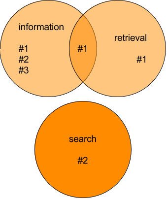

# Booleovo pretraživanje

`AND`, `OR`, `NOT`
---
Pronađi sve **dokumente** koji sadrže **pojmove** i zadovoljavaju uvjete:

```
sveučilište AND zadar
```

```
mmt OR mma
```

```
mmt AND NOT mma
```

```
(information AND retrieval) OR search
```

---

# Terminologija

<dl>
  <dt>Dokumenti</dt><!-- .element: class="fragment" data-fragment-index="1" -->
  <dd>Knjige, poglavlja, stranice, web stranice, novinski članci...</dd><!-- .element: class="fragment" data-fragment-index="1" -->

  <dt>Zbirke dokumenata, korpusi</dt><!-- .element: class="fragment" data-fragment-index="2" -->
  <dd>Svi dokumenti</dd><!-- .element: class="fragment" data-fragment-index="2" -->

  <dt>Pojmovi</dt><!-- .element: class="fragment" data-fragment-index="3" -->
  <dd>Kao riječi, ali možda i <em>Sveučilište u Zadru</em> i <em>A1</em></dd><!-- .element: class="fragment" data-fragment-index="3" -->
</dl>
---
<!-- .slide: class="audience-question" -->

# Da li se podudaraju?

```
(information AND retrieval) OR search
```

* &shy;<!-- .element: class="fragment" --> \#1: _a book about information retrieval_ <span>&rarr;
  Match</span><!-- .element: class="fragment" style="color: green;" -->
* &shy;<!-- .element: class="fragment" --> \#2: _a book about the search for information_ <span>&rarr;
  Match</span><!-- .element: class="fragment" style="color: green;" -->
* &shy;   <!-- .element: class="fragment" --> \#3: _a book about information_ <span>&rarr; No
  Match</span><!-- .element: class="fragment" style="color: red;" -->

Bilješke:
Pitanja
---

# Terminologija

<dl>
  <dt>Informacijska potreba (eng. Information need)</dt><!-- .element: class="fragment" data-fragment-index="1" -->
  <dd>Što korisnik traži:<p><em>Želim naučiti o informacijskom pretraživanju i pronalaženju</em></p></dd><!-- .element: class="fragment" data-fragment-index="1" -->

  <dt>Upit (eng. Query)</dt><!-- .element: class="fragment" data-fragment-index="2" -->
  <dd>Kako korisnik komunicira s računalom:<p><code>(information AND retrieval) OR search</code></p></dd><!-- .element: class="fragment" data-fragment-index="2" -->
</dl>

&shy;<!-- .element: class="fragment" --> Glasovni asistenti i generativni AI alati poput ChatGPT-a, premošćuju razliku između *informacijske potrebe* i *upita*


Bilješke:
---

# Jednostavna implementacija Booleaovog pretraživanja

1. Izračunaj popis rezultata za svaki pojam iz upita: Grep
2. Primijeni booleove operatore: Presjek / Unija

---
# Grep

<!-- .slide: class="audience-question" -->

* Upit: *book*
* Dokument: *a book about information retrieval*

Usporedi upit s dokumentom od prvog do posljednjeg znaka

1. <!-- .element: class="fragment fade-in-then-out" data-fragment-index="1" --><span>a␣bo</span><!-- .element: class="fragment highlight-blue" data-fragment-index="1" -->ok about information retrieval
2. <!-- .element: class="fragment fade-in-then-out" data-fragment-index="2" -->a<span>␣boo</span><!-- .element: class="fragment highlight-blue" data-fragment-index="2" -->k about information retrieval
3. <!-- .element: class="fragment" data-fragment-index="3" -->a <span>book</span><!-- .element: class="fragment highlight-blue" data-fragment-index="3" --> about information retrieval <span>&rarr; Podudara se</span><!-- .element: class="fragment" style="color: green;" -->

Bilješke: Koji su neki od problema s grepom?
---

# Izračunavanje popisa rezultata

## Generiraj popis pojmova iz upita

```
(information AND retrieval) OR search
```

&darr;

1. *information*
2. *retrieval*
3. *search*

## Grep za svaki pojam u svakom dokumentu

1. *a book about information retrieval*
2. *a book about the search for information*
3. *a book about retrieving information*

Bilješke:
---
<!-- .slide: class="audience-question" -->

# Generate result lists

**Upitni pojam: *information***
&rarr; <span>[#1, #2, #3]</span><!-- .element: class="fragment" data-fragment-index="1" -->

* #1 *a book about information retrieval*
* #2 *a book about the search for information*
* #3 *a book about retrieving information*

**Upitni pojam: *retrieval*** &rarr; <span>[#1]</span><!-- .element: class="fragment" data-fragment-index="2" -->

* #1 *a book about information retrieval*
* #2 *a book about the search for information*
* #3 *a book about retrieving information*

**Upitni pojam: *search*** &rarr; <span>[#2]</span><!-- .element: class="fragment" data-fragment-index="3" -->

* #1 *a book about information retrieval*
* #2 *a book about the search for information*
* #3 *a book about retrieving information*

Bilješke:
Pitanja
---

<!-- .slide: class="audience-question" --> 

# Presjek / Unija

* &shy;<!-- .element: class="fragment" data-fragment-index="1" --> \#1: _a book about information retrieval_

* &shy;<!-- .element: class="fragment" data-fragment-index="1" --> \#2: _a book about the search for information_
* &shy;<!-- .element: class="fragment" data-fragment-index="1" --> \#3: _a book about retrieving information_

```
(information AND retrieval) OR search
```

<!-- .element: class="fragment" data-fragment-index="1" -->

 <!-- .element: class="fragment" data-fragment-index="2" -->

Bilješke:
Pitanja
---

# Kompleksnost

* [Big &Omicron; notacija](https://en.wikipedia.org/wiki/Big_O_notation)
* Opisuje vremensku ili memorijsku složenost algoritama i struktura podataka
* Koji ulazi utječu na njihovo vrijeme izvođenja i zahtjeve za memorijom?
* Razmotri najgori slučaj

---

# Primjeri vremenske kompleksnosti

*Koliko je petlji potrebno?*

| Big &Omicron; | Naziv      | Primjer                           | Objašnjenje                                   |
|---------------|-----------|-----------------------------------|-----------------------------------------------|
| Ο(1)          | Konstantna | Paran ili neparan broj?           | Nema petlje                                   |
| Ο(n)          | Linearna   | Izračunavanje zbroja polja        | Prolazak kroz sve vrijednosti                 |
| Ο(n²)         | Kvadratna  | Pronalaženje duplikata u nesortiranom polju | Usporedba svake vrijednosti sa svakom drugom |

---

<!-- .slide: class="audience-question" -->

# Kompleksnost

## Grep

Pretraži svaki pojam iz upita kao niz u svakom dokumentu: <!-- .element: class="fragment" -->

$$O(\text{broj pojmova u upitu} \times \text{ukupna duljina svih dokumenata})$$<!-- .element: class="fragment" -->

## Unija

Spoji popise rezultata (bez duplikata): <!-- .element: class="fragment" -->

$$O(\text{broj rezultata})$$<!-- .element: class="fragment" -->

## Presjek

Usporedi prvi popis rezultata sa svakim sljedećim: <!-- .element: class="fragment" -->

$$O(\text{broj pojmova u upitu} \times \text{broj rezultata po pojmu})$$<!-- .element: class="fragment" -->

Bilješke:
Pitanja
---

# Složenost grepa

* $O(\text{broj pojmova u upitu} \times \text{ukupna duljina svih dokumenata})$
* Može potrajati jako dugo

#### <!-- .element: class="fragment" data-fragment-index="1" --> Primjer

* &shy;<!-- .element: class="fragment" data-fragment-index="1" -->*Engleska Wikipedija*: 6 milijuna članaka, 12 milijardi znakova, 1,2 milijuna
  jedinstvenih pojmova
* &shy;<!-- .element: class="fragment" data-fragment-index="1" -->grep: 2 pojma iz upita &times; 12 GB = **24 milijardi usporedbi niza**

Napomene: Kako se ovo može poboljšati?

---

# Nedostaci grepa

* &shy;<!-- .element: class="fragment" -->   Odgovara li _books_ pojmu _book_?
    * &shy;<!-- .element: class="fragment" -->Ne može se nositi s jedninom/množinom, *books* ne odgovara *book*.
* &shy;<!-- .element: class="fragment" --> _go_ naspram _went_
* &shy;<!-- .element: class="fragment" --> _running_ naspram _run_
* &shy;<!-- .element: class="fragment" --> _go_ naspram _gong_

Nije prilagođeno korisnicima!<!-- .element: class="fragment" -->

Bilješke