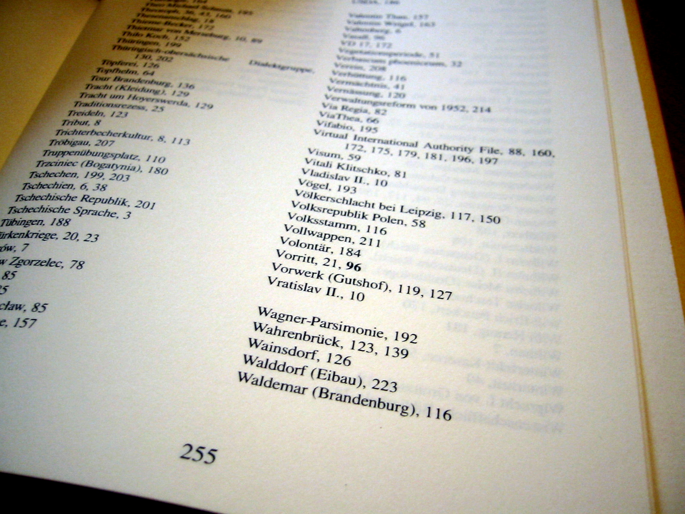

# Matrica pojmova i dokumenata

Poznata i kao _matrica incidencije_

Smanjuje vremensku složenost operacije `grep`

<dl>
  <dt>Redovi</dt>
  <dd>Jedinstveni pojmovi iz upita</dd>

  <dt>Stupci</dt>
  <dd>Dokumenti</dd>

  <dt>Polja</dt>
  <dd>1 ako je <em>pojam</em> prisutan u <em>dokumentu</em>, inače 0</dd>
</dl>

Dokumenti moraju biti prethodno obrađeni
---

<!-- .slide: class="audience-question" -->

* \#1: _a book about information retrieval_
* \#2: _a book about the search for information_
* \#3: _a book about information_

&darr;

|                 | #1                                                           | #2                                                           | #3                                                            |
|-----------------|--------------------------------------------------------------|--------------------------------------------------------------|---------------------------------------------------------------|
| **Book**        | 1<!-- .element: class="fragment" data-fragment-index="1" --> | 1<!-- .element: class="fragment" data-fragment-index="5" --> | 1<!-- .element: class="fragment" data-fragment-index="9" -->  |
| **Information** | 1<!-- .element: class="fragment" data-fragment-index="2" --> | 1<!-- .element: class="fragment" data-fragment-index="6" --> | 1<!-- .element: class="fragment" data-fragment-index="10" --> |
| **Retrieval**   | 1<!-- .element: class="fragment" data-fragment-index="3" --> | 0<!-- .element: class="fragment" data-fragment-index="7" --> | 0<!-- .element: class="fragment" data-fragment-index="11" --> |
| **Search**      | 0<!-- .element: class="fragment" data-fragment-index="4" --> | 1<!-- .element: class="fragment" data-fragment-index="8" --> | 0<!-- .element: class="fragment" data-fragment-index="12" --> |

Napomene:
Pitanje za publiku
---

<!-- .slide: class="audience-question" -->

|             | #1 | #2 | #3 |
|-------------|----|----|----|
| Book        | 1  | 1  | 1  |
| Information | 1  | 1  | 1  |
| Retrieval   | 1  | 0  | 0  |
| Search      | 0  | 1  | 0  |

&darr;

<dl>
  <dt>Vektor dokumenta</dt>
  <dd>#1: <code>(1, 1, 1, 0)</code><!-- .element: class="fragment" --></dd>
  
  <dt>Vektor pojma</dt>
  <dd>Retrieval: <code>(1, 0, 0)</code><!-- .element: class="fragment" --></dd>
</dl>

Bilješka:
Pitanja
---

<!-- .slide: class="audience-question" -->

# Kako pretraživati

Zamijeni svaki pojam u upitu s odgovarajućim vektorom pojma

* $\text{(information AND retrieval) OR search}$ <!-- .element: class="fragment" -->
* $= (111 \cap 100) \cup 010$ <!-- .element: class="fragment" -->
* $= 100 \cup 010$ <!-- .element: class="fragment" -->
* $= 110$ <!-- .element: class="fragment" -->
* = \#1 i \#2 <!-- .element: class="fragment" -->
    * &shy;<!-- .element: class="fragment" --> \#1: _a book about information retrieval_
    * &shy;<!-- .element: class="fragment" --> \#2: _a book about the search for information_

<!-- .element: style="list-style-type: none;" -->

Bilješka:
Pitanja
---

<!-- .slide: class="audience-question" -->

# Vremenska složenost

 $$O(\text{broj pojmova u upitu} \times \text{broj jedinstvenih pojmova})$$<!-- .element: class="fragment" data-fragment-index="1" -->

## <!-- .element: class="fragment" data-fragment-index="2" -->Primjer

* &shy;<!-- .element: class="fragment" data-fragment-index="2" -->*Engleska Wikipedija*: 6 milijuna članaka, 12 milijardi znakova, 1,2 milijuna
  jedinstvenih pojmova
* &shy;<!-- .element: class="fragment" data-fragment-index="2" -->grep: 2 pojma iz upita x 12 GB = **24 milijarde usporedbi nizova**
* &shy;<!-- .element: class="fragment" data-fragment-index="3" -->Matrica pojmova i dokumenata: 2 pojma iz upita &times; 1,2 milijuna
  jedinstvenih pojmova = **2,4 milijuna pretraga**

Bilješka:
Pitanja
---

<!-- .slide: class="audience-question" -->

# Veličina

$$\text{broj(jedinstvenih pojmova)} \times \text{broj(dokumenata)} \times \text{veličina bita}$$<!-- .element: class="fragment" data-fragment-index="1" -->

## <!-- .element: class="fragment" data-fragment-index="2" -->Primjer

* &shy;<!-- .element: class="fragment" data-fragment-index="2" -->*Engleska Wikipedija*: 6 milijuna članaka, 12 milijardi znakova, 1,2 milijuna
  jedinstvenih pojmova
* &shy;<!-- .element: class="fragment" data-fragment-index="3" -->1,2 milijuna jedinstvenih pojmova &times; 6 milijuna članaka =
  7.200.000.000.000 ćelija = 7,2 terabita = **900 gigabajta**

To je preveliko! Kako se veličina može smanjiti?<!-- .element: class="fragment" data-fragment-index="4" -->

&darr;<!-- .element: class="fragment" data-fragment-index="5" -->

&shy;<!-- .element: class="fragment" data-fragment-index="5" -->Matrica je vrlo rijetka, većinom sadrži nule

Bilješka:
Pitanja
---
&shy;<!-- .element: class="stretch" --> 

Bilješke
